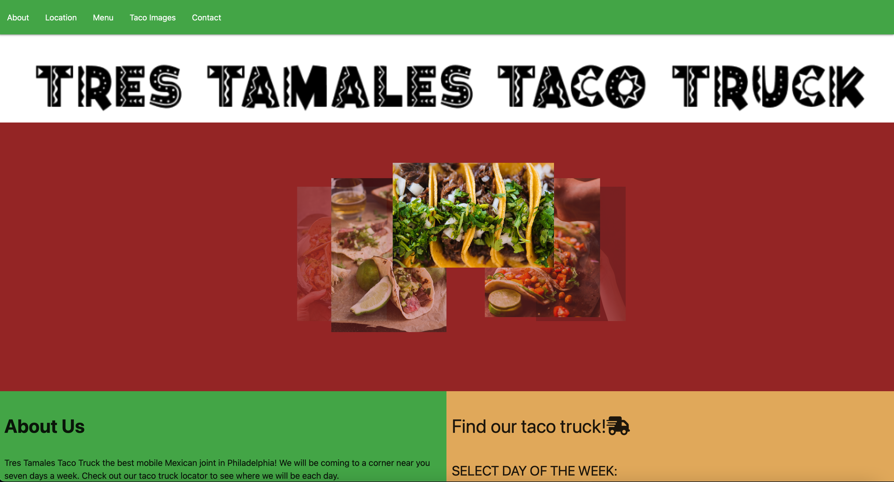

# Tres Tamales Taco Truck

## Description 
The goal of this project was to create a website for a fictional business called Tres Tamales Taco Truck. The website contains general information including an about us section, menu, and contact information. The site also includes a taco truck locator, which will display the location of the truck according to the day of the week selected by the user. Technologies used were HTML, CSS, and JavaScript. APIs used were Leaflet and Unsplashed.

## Site Image

To visit the site click [here](https://thaivytran.github.io/project-1/). 

## Credits
Taco pics courtesy of Unsplashed. 

Menu placeholder courtesy of Green Ghost Tacos.

## License
Please refer to the license in the repo. 
